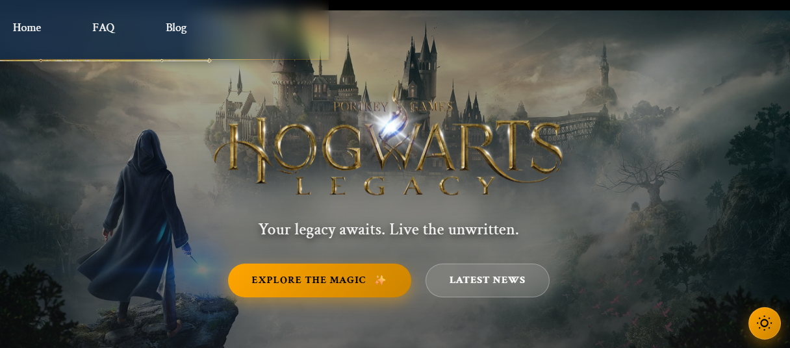

# 🪄 Hogwarts Legacy Fan Site



> _Your legacy awaits. Live the unwritten._

## 🌐 Sitio Web

[Visita el Sitio Web](https://frankusqabant.github.io/astro-sitio-web/)

## 🧙‍♂️ Acerca del Proyecto

Bienvenido a una experiencia web inmersiva inspirada en el mágico mundo de **Hogwarts Legacy**. Este proyecto ha sido diseñado meticulosamente para combinar una estética premium con un rendimiento técnico excepcional, utilizando la potencia de **Astro** y la interactividad de **React**.

El objetivo fue crear una landing page que no solo informe, sino que transporte al usuario al mundo mágico a través de animaciones sutiles, un diseño visual impactante y una experiencia de usuario fluida.

## ✨ Características Mágicas

### 🎨 UI/UX Premium

- **Diseño Inmersivo:** Uso de paleta de colores dorados y oscuros, tipografías elegantes (Crimson Text) y efectos de _Glassmorphism_.
- **Animaciones Sutiles:** Entradas _fade-in_ escalonadas, efectos _hover_ con brillos y transiciones suaves.
- **Modo Oscuro / Claro:** 🌓 Sistema de temas completo con toggle flotante, persistencia en `localStorage` y detección de preferencias del sistema.
- **Skeleton Loading:** ✨ Estado de carga elegante con animación _shimmer_ dorada para las tarjetas de información.

### ⚡ Rendimiento y Tecnología

- **Arquitectura de Islas:** Hidratación parcial con Astro para un rendimiento óptimo.
- **Lazy Loading:** Carga diferida de imágenes y videos para una velocidad inicial instantánea.
- **Responsive Design:** Adaptación fluida desde móviles hasta pantallas 4K.

### ♿ Accesibilidad

- **Navegación por Teclado:** Focus states visibles y claros.
- **Lectores de Pantalla:** Etiquetas ARIA y textos alternativos descriptivos.
- **Preferencias de Usuario:** Respeta `prefers-reduced-motion`.

## 🛠️ Tecnologías Usadas


## 🚀 Comenzando la Aventura

Sigue estos pasos para invocar el proyecto en tu máquina local.

### Prerrequisitos

- **Node.js** (v18 o superior)
- **npm** (incluido con Node.js)

### Hechizo de Instalación

1.  **Clonar el repositorio:**

    ```bash
    git clone <url-del-repositorio>
    cd purple-photon
    ```

2.  **Instalar las dependencias mágicas:**

    ```bash
    npm install
    ```

3.  **Iniciar el portal (Servidor de desarrollo):**

    ```bash
    npm run dev
    ```

4.  Abre tu navegador en `http://localhost:4321` y... **¡Revelio!** ✨

## 🧞 Comandos del Grimorio

| Comando           | Acción                                                |
| :---------------- | :---------------------------------------------------- |
| `npm run dev`     | Inicia el servidor local para desarrollo.             |
| `npm run build`   | Compila el sitio para producción (carpeta `./dist/`). |
| `npm run preview` | Previsualiza la versión compilada localmente.         |

## 📂 Mapa del Merodeador (Estructura)

```text
/
├── public/          # Artefactos estáticos (imágenes, favicon)
├── src/
│   ├── components/  # Componentes Astro y React (Header, Cards, FAQ...)
│   ├── data/        # Datos estáticos (menús, textos)
│   ├── layouts/     # Plantilla maestra (Layout.astro)
│   ├── pages/       # Rutas mágicas (index.astro, blog...)
│   └── types/       # Definiciones de tipos TypeScript
└── package.json     # Manifiesto del proyecto
```

---

<div align="center">
  <p>Hecho con 💜 y mucha magia.</p>
</div>
